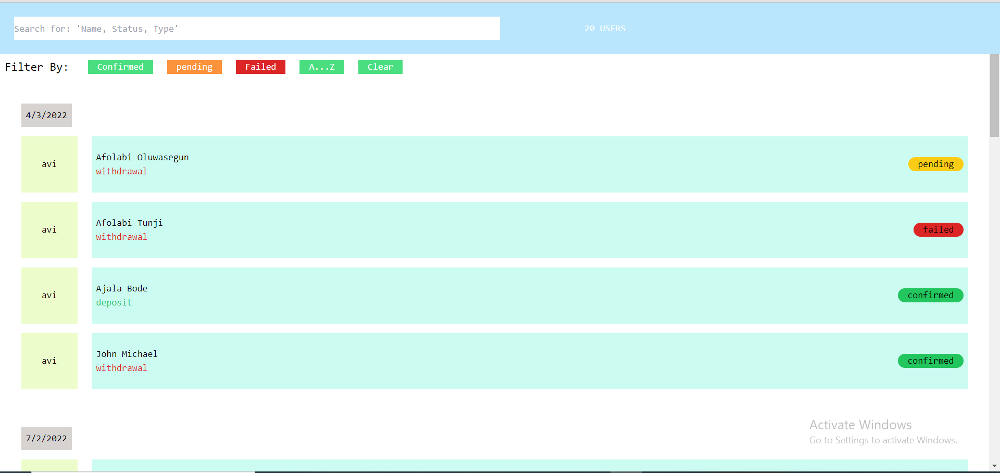
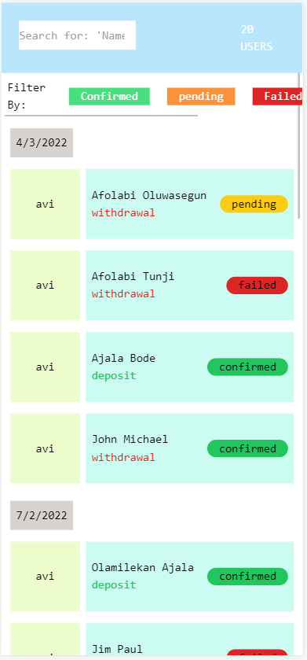

# helicarrier
In the project root directory, you can run:

### `npm run dev`
This uses the `concurrently` package to start both the GraphQL server and the App in develipment stage

## Implementation

    
    

The app is a very simple transaction history page with the following columns: ID, Status, Date, Name, and Type.
The graphQL server 
This APP enables the admin to search for users data based on the following keywords - "Name, Status, TransactionType"

The ambiguity of data management was reduced using redux toolkit. This made it easy for eact filter function to be created and passed into the app